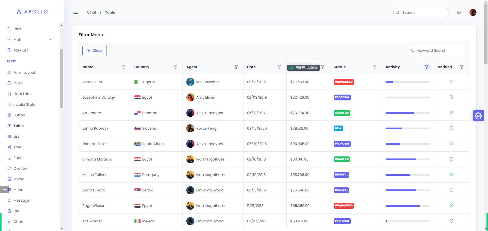

# 后台管理系统框架 ( 前端 )

## 技术选型及官方文档

Vue3 + Vite + + Typescript + Tailwindcss + PrimeVue UI 

Vue: https://vuejs.org/

Tailwindcss: https://tailwindcss.com/docs/guides/vite

Primevue: https://tailwind.primevue.org/builder

## 相关依赖 

tailwindcss primevue 根据官方教程导入

```shell
npm i axios vue-router pinia tailwindcss primevue scss postcss autoprefixer unplugin-vue-components -D -S
```

## 配置自动导入

vite.config.ts

```typescript
// 引入自动导入primeVue组件的插件
import Components from 'unplugin-vue-components/vite'
import { PrimeVueResolver } from 'unplugin-vue-components/resolvers'

// https://vitejs.dev/config/
export default defineConfig({
  plugins: [
    ...
    Components({
      resolvers:[
        PrimeVueResolver()
      ]
    }),
    ...
  ],
})

```

## 引入表单验证插件

```shell
npm i vee-validate yup -S -D
```
## primevue + vee-validate 实现登录表单验证
```typescript
<template>
  <Form @submit="onSubmit" @invalid-submit="onInvalidSubmit" :validation-schema="schema"  v-slot="{ values }">
    <Field id="username" name="username" v-slot="{ handleChange, value, errorMessage,meta }" >
      <FloatLabel class="mt-7">
        <InputText id="username" class="w-full" :modelValue="value" @update:modelValue="handleChange" :invalid="handleInvalid(meta)"/>
        <label for="username">用户名</label>
      </FloatLabel>
      <pre class="text-red-400 text-xs pt-1">{{ errorMessage }}</pre>
    </Field>
    <Field id="password" name="password" v-slot="{ handleChange, value, errorMessage,meta }">
        <FloatLabel class="mt-7">
          <InputText id="password" class="w-full" :modelValue="value" @update:modelValue="handleChange" :invalid="handleInvalid(meta)"/>
          <label for="password">密码</label>
        </FloatLabel>
        <pre class="text-red-400 text-xs pt-1">{{ errorMessage }}</pre>
    </Field>
    <Button type="submit" class="mt-7 w-full" label="登录" size="small">登录</Button>
  </Form>
</template>
<script setup lang="ts">
import { Form, Field } from "vee-validate";
import * as yup from "yup";

const schema = yup.object({
    username: yup.string().required('请输入用户名'),
    password: yup.string().required('请输入密码'),
});
function onSubmit(values:any) {
  console.log(JSON.stringify(values,null,2));
}

function onInvalidSubmit({ values, errors, results } :any){
  console.log(values); // current form values
  console.log(errors); // a map of field names and their first error message
  console.log(results); // a detailed map of field names and their validation results
}
function handleInvalid(meta:any):boolean{
    return meta.errors.length || (meta.dirty && (!meta.validated || !meta.valid))
}
</script>

```



https://apollo.primevue.org/

## 规划：

1. 菜单系统

2. 布局系统（配置化）

   侧边栏、顶部导航布局变化

   主题色变化

   样式大小的变化（分等级）

3. 
